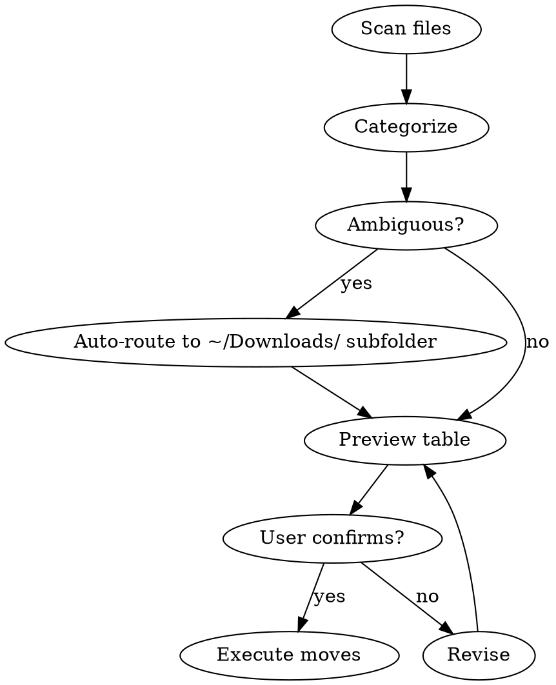

# macOS File Sorter

## Overview

Preview-first file organization. Show proposed moves as a table, confirm, then execute. Never delete. Trash is reserved strictly for verified duplicate files; all other unmatched files auto-route to categorized subfolders in `~/Downloads/` with descriptive filenames.

## When to Use

- Downloads or Desktop cluttered with mixed files
- Importing photos from camera/SD card (Fujifilm, iPhone)
- Organizing code repos, design assets, or school documents
- Batch of files with unclear destinations

## When NOT to Use

- Automated/unsupervised sorting (requires explicit confirmation of the preview table before execution; ambiguous files are auto-routed to `~/Downloads/` subfolders to avoid prompt fatigue)
- System files, application bundles, or dotfiles (except the skip list)
- Files already in correct destination

## Directory Layout (Reference Implementation)

Adapt paths to the user's system. The table below shows the default layout.

| Purpose               | Path                                                                           |
| --------------------- | ------------------------------------------------------------------------------ |
| Code repos (Codeberg) | `~/no-store/codeberg/`                                                         |
| Code repos (GitHub)   | `~/no-store/github/`                                                           |
| Code repos (no forge) | `~/no-store/no-forge/`                                                         |
| Design work           | `~/artndesign/`                                                                |
| School (DHBW)         | `~/Nextcloud/Ablage/[Semester]/` — example: `WWIT2`; ask which semester/module |
| Photos                | `~/Pictures/`                                                                  |
| Commons staging       | `~/Pictures/commons-ready/`                                                    |
| Downloads             | `~/Downloads/`                                                                 |
| Documents             | `~/Documents/`                                                                 |
| Desktop               | `~/Desktop/`                                                                   |

## File Type Mappings

| Extension(s)         | Type                  | Destination                                                                                                                                                                                       |
| -------------------- | --------------------- | ------------------------------------------------------------------------------------------------------------------------------------------------------------------------------------------------- |
| RAF                  | Fujifilm RAW          | `~/Pictures/YYYY/[Event]/` — determine `YYYY` from EXIF `DateTimeOriginal` if available (`mdls -name kMDItemContentCreationDate`), otherwise use file modification date                           |
| JPEG, JPG            | Photo                 | `~/Pictures/YYYY/[Event]/` — pair with RAF if present; determine `YYYY` from EXIF `DateTimeOriginal` if available (`mdls -name kMDItemContentCreationDate`), otherwise use file modification date |
| PNG                  | Screenshot or graphic | `~/Pictures/Screenshots/` or Commons staging — ask context                                                                                                                                        |
| HEIC                 | iPhone photo          | `~/Pictures/YYYY/` — determine `YYYY` from EXIF `DateTimeOriginal` if available (`mdls -name kMDItemContentCreationDate`), otherwise use file modification date                                   |
| AI, PSD, XCF, INDD   | Design source         | `~/artndesign/[project]/`                                                                                                                                                                         |
| SVG, EPS             | Vector                | `~/artndesign/` or repo — ask context                                                                                                                                                             |
| TOML, XLIFF, PO, POT | Localization          | `~/no-store/[forge]/[project]/` — ask which project                                                                                                                                               |
| sh, py, rb, js, ts   | Script                | `~/no-store/[forge]/[project]/`                                                                                                                                                                   |
| yml, yaml, conf, env | Config                | `~/no-store/[forge]/[project]/` or `~/no-store/no-forge/`                                                                                                                                         |
| PDF                  | Document              | `~/Documents/` or `~/Nextcloud/Ablage/[Semester]/[module]/` — ask context                                                                                                                         |
| DMG, PKG             | macOS installer       | `~/Downloads/Installers/` with descriptive name                                                                                                                                                   |
| ZIP                  | Archive               | `~/Downloads/Archives/` with descriptive name                                                                                                                                                     |
| md, txt              | Note                  | `~/Downloads/Notes/` with descriptive name                                                                                                                                                        |

## Process

1. **Target** — confirm which directory to sort (Downloads, Desktop, card mount, etc.)
2. **Scan** — `find "[dir]" -maxdepth 1 -type f ! -name ".*"` — no recursion unless asked; dotfiles and symlinks excluded
3. **Categorize** — match against mappings above; ambiguous files → auto-route to `~/Downloads/` subfolder with descriptive name
4. **Preview** — render table: `source → destination` for every file
5. **Confirm** — wait for explicit yes before any move
6. **Execute** — for each file, check if destination exists. Apply collision handling rules (auto-rename ambiguous files; halt on non-ambiguous collisions). Then `mv -vn "source" "dest"`; quote all paths; check exit code after every move
7. **Verify** — after each move, confirm source no longer exists and destination is readable
8. **Report** — moved N, skipped M, failed F (list failures with reason); if any move failed, halt and report remaining moves as unexecuted

## Quick Reference

| Operation        | Command/Action                                                                        |
| ---------------- | ------------------------------------------------------------------------------------- |
| Scan directory   | `find "[dir]" -maxdepth 1 -type f ! -name ".*"` — excludes dotfiles and symlinks      |
| Move file        | `mv -vn "source" "dest"` — `-n` refuses if dest exists, `-v` verbose                  |
| Trash file       | Only after `shasum -a 256` match against destination: `mv -vn "file" ~/.Trash/`       |
| Create directory | Ask before `mkdir -p "path"`                                                          |
| Skip silently    | `.DS_Store`, `__MACOSX`, `.localized`, `Thumbs.db`, all dotfiles (`.*`), all symlinks |

## Duplicate Verification

Trash is reserved strictly for verified duplicates. Verification requires a cryptographic hash match.

**Procedure:**

1. Compute `shasum -a 256` for the candidate file.
2. Compute `shasum -a 256` for the existing file at the intended destination.
3. Only if hashes are identical, the file is a verified duplicate and may be moved to `~/.Trash/`.
4. Filename match or file size match alone is insufficient.
5. If `shasum` is unavailable, use `cmp --silent file1 file2` for a byte-level comparison instead.

## RAF+JPEG Pairs

Fujifilm X-T50 saves RAF+JPEG together. Always move them to the same folder. Never separate a pair.

## Commons Staging

Photos going to Wikimedia Commons → stage in `~/Pictures/commons-ready/`. **REQUIRED SUB-SKILL:** Use `uploading-to-commons` for Wikimedia Commons upload workflow. Don't skip staging.

## macOS Rules

- Skip silently: `.DS_Store`, `__MACOSX`, `.localized`, `Thumbs.db`, all dotfiles (`.*`), and all symlinks
- Trash strictly for verified duplicates only — never `rm`: verify with `shasum -a 256` before moving to `~/.Trash/`
- Check destination exists; ask before `mkdir -p`
- Use `~/` paths, not `/Users/michael/`
- Quote all file paths in Bash commands
- Use `-vn` with every `mv`: `-v` (verbose), `-n` (no clobber). Note: `-i` (interactive) and `-n` are mutually exclusive on macOS; use `-vi` if you want prompts instead of no-clobber
- Validate generated destination path is within `~/` before executing; reject paths with `..` or absolute paths outside home
- Check exit code of every `mv`; halt on non-zero and report failure before proceeding
- After each move, verify source no longer exists and destination is readable

## Collision Handling

Using `mv -n` silently skips existing destinations without error (exit code 0 on macOS). Therefore, always check destination existence before moving; rely on `-n` only as a safety net. To prevent the entire batch from halting on the first collision:

1. **Before each move**, check if the destination path already exists.
2. **For auto-routed ambiguous files**: if destination exists, generate an alternative filename by appending an incrementing suffix (`-1`, `-2`, etc.) or a timestamp, then retry until a free filename is found.
3. **For non-ambiguous categorized files**: if destination exists, halt and report the collision for user resolution. Do not auto-rename.
4. Only after confirming a free destination path, execute `mv -vn`.

## Ambiguous Files

Files with no clear destination are automatically routed to categorized subfolders in `~/Downloads/` with descriptive filenames. Do not prompt the user for these.

| Category      | Subfolder                 | Filename Pattern                   |
| ------------- | ------------------------- | ---------------------------------- |
| Installers    | `~/Downloads/Installers/` | `[AppName]-[Version]-[Date]`       |
| Archives      | `~/Downloads/Archives/`   | `[ContentDescription]-[Date]`      |
| Notes / Text  | `~/Downloads/Notes/`      | `[Topic]-[Date]`                   |
| Uncategorized | `~/Downloads/Unsorted/`   | `[TypeHint]-[Date]-[OriginalName]` |

Generate filenames from file content, metadata, or context clues. If uncertain, use the original name plus a date prefix.

## Common Mistakes

| Mistake                                     | Fix                                                                              |
| ------------------------------------------- | -------------------------------------------------------------------------------- |
| Moving without preview table                | Always render `source → destination` first                                       |
| Using unquoted paths in Bash                | Always quote: `mv -vn "source" "dest"`                                           |
| Using `mv` without `-n` (no clobber)        | Always use `-vn` to prevent silent overwrites                                    |
| Using `rm` or trashing unique files         | Trash only verified duplicates; route others to `~/Downloads/` subfolders        |
| Ignoring `mv` exit code                     | Check `$?` after every move; halt on failure                                     |
| Moving without verifying destination        | After move, confirm source gone and destination readable                         |
| Blindly trusting generated paths            | Validate destination is within `~/`; reject `..` or external absolute paths      |
| Separating RAF/JPEG pairs                   | Move both to same folder                                                         |
| Recursing subdirectories                    | `-maxdepth 1` unless asked                                                       |
| Moving without checking destination exists  | Check before `mv`; auto-rename ambiguous files, halt on non-ambiguous collisions |
| Trashing without cryptographic verification | Always run `shasum -a 256` against the destination file first                    |

## Red Flags — STOP and Confirm

- About to move files without showing preview table
- About to use `rm` or `sudo rm`
- About to trash a file that is not a verified duplicate
- About to separate RAW+JPEG pairs
- About to prompt user for ambiguous files instead of auto-routing to `~/Downloads/`
- Unquoted file paths in Bash commands (paths containing spaces will fail)
- About to use `mv` without `-n` flag (risk of silent overwrite), or using both `-i` and `-n` together (they are mutually exclusive on macOS)
- Destination path contains `..` or points outside `~/`
- About to ignore a non-zero exit code from `mv`
- About to proceed to next move without verifying the last one succeeded
- About to execute `mv` without checking destination for collisions
- About to trash a file without `shasum -a 256` verification against the existing destination

**All of these mean: pause, fix the issue, and wait for explicit yes.**
