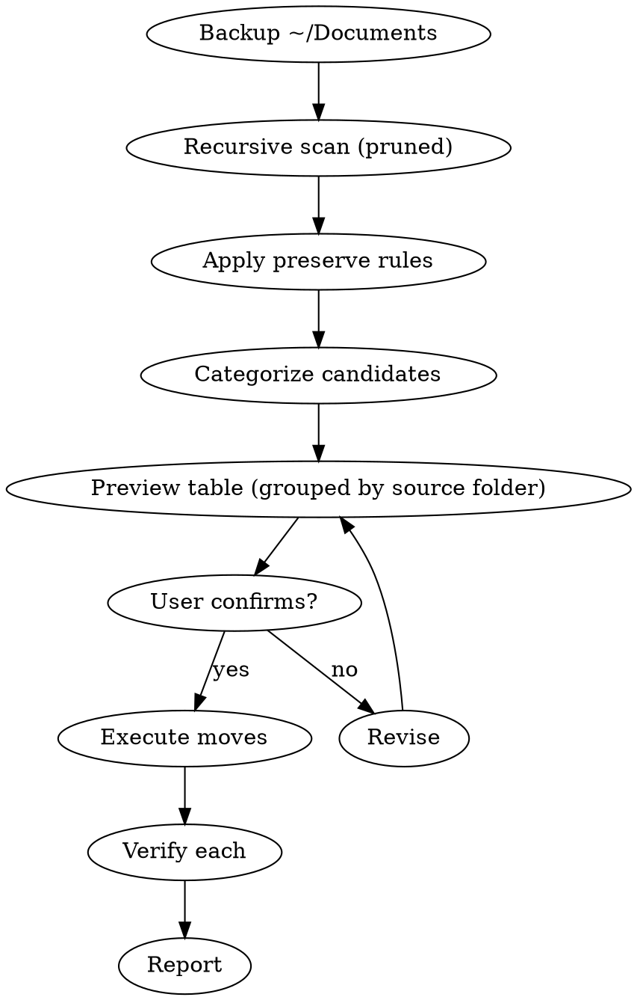

# macOS File Sorter

## Overview

Backup-first, in-place organization of `~/Documents`. Recursively scan the whole
folder tree, group loose files into typed buckets **inside `~/Documents`**, and
leave deliberately organized folders untouched. Show every proposed move as a
table, confirm, then execute. Never delete — Trash is used only for
cryptographically verified duplicates, and a full backup is made before anything
moves.

Everything is deterministic: the same tree produces the same plan every run.

## When to Use

- `~/Documents` cluttered with loose, mixed files
- Files scattered across nested subfolders that need grouping by type
- A one-time declutter, or a repeatable tidy pass (safe to re-run — buckets are pruned)

## When NOT to Use

- Sorting folders other than `~/Documents` (this skill is Documents-only by design)
- Unsupervised/automated runs — the preview table must be confirmed first
- System files, application bundles, package folders, or dotfiles

## Fixed Target

The target is always `~/Documents`. Do not ask which directory. Do not sort
Downloads, Desktop, external volumes, or anything outside `~/Documents`.

## Buckets

All destinations are subfolders **inside** `~/Documents`. Files never leave the
Documents tree.

| Bucket                | Extensions                                                      |
| --------------------- | -------------------------------------------------------------- |
| `~/Documents/PDFs/`   | pdf                                                            |
| `~/Documents/Images/` | png jpg jpeg gif heic webp tiff tif bmp svg raf cr2 nef arw dng |
| `~/Documents/Audio/`  | mp3 m4a wav flac aac ogg                                       |
| `~/Documents/Video/`  | mp4 mov m4v avi mkv webm                                       |
| `~/Documents/Archives/`   | zip tar gz tgz bz2 rar 7z                                  |
| `~/Documents/Installers/` | dmg pkg                                                    |
| `~/Documents/Office/` | doc docx xls xlsx ppt pptx odt ods odp csv rtf pages numbers key |
| `~/Documents/Code/`   | sh py rb js ts jsx tsx json yml yaml toml conf env ini html css xml |
| `~/Documents/Notes/`  | md txt                                                         |
| `~/Documents/Unsorted/`   | everything unmatched                                      |

Create a bucket only when it is needed (ask before the first `mkdir -p`).

## What Gets Sorted (Preserve Rules)

The scan recurses to any depth, but only **loose** files move. A file is loose
if it sits directly in `~/Documents`, or inside a folder that is NOT protected.

**A subfolder is PROTECTED (left completely untouched) if any of these is true —
all deterministic, no guessing:**

1. it contains one or more subfolders (a deliberate tree / project), **or**
2. every file directly in it already belongs to the same bucket category (already
   a coherent single-type collection), **or**
3. it is a bucket, an app/package bundle (`.app`, `.rtfd`, `.photoslibrary`,
   `.bundle`, `.framework`, `.pkg`), or a dot-directory (`.git`, etc.).

Everything else — root-level loose files and files inside genuinely mixed piles —
is a move candidate.

**Preserve means:** folders are never deleted or renamed. Files that leave a
folder leave it empty; the empty folder is kept in place. The preview table
groups candidates by source folder so any folder can be excluded in one word
before execution.

## Process



1. **Backup** — `cp -a "$HOME/Documents" "$HOME/Documents-backup-$(date +%Y%m%d-%H%M%S)"`.
   Confirm the backup exists and is non-empty **before any move**. The backup lives
   outside `~/Documents`, so it is never scanned or sorted.
2. **Scan** — recursive `find` with pruning (see Quick Reference). Excludes buckets,
   bundles, dotfiles, dot-directories, and symlinks.
3. **Preserve rules** — apply the PROTECTED test above; drop protected folders' files.
4. **Categorize** — match remaining candidates to buckets by extension; unmatched → `Unsorted`.
5. **Preview** — render a table of `source → destination`, **grouped by source folder**.
6. **Confirm** — wait for explicit yes. Honor any "leave folder X" exclusions.
7. **Execute** — per file: resolve collisions (below), then `mv -vn "source" "dest"`;
   quote all paths; check exit code after every move.
8. **Verify** — after each move, confirm the source is gone and the destination is readable.
9. **Report** — moved N, deduped D, skipped M, failed F (list failures with reason).
   If any move failed, halt and report the remaining moves as unexecuted.

## Quick Reference

| Operation      | Command/Action                                                                      |
| -------------- | ---------------------------------------------------------------------------------- |
| Backup         | `cp -a "$HOME/Documents" "$HOME/Documents-backup-$(date +%Y%m%d-%H%M%S)"`           |
| Scan (pruned)  | see command below — recursive, prunes buckets/bundles/dotdirs, prints loose files   |
| Move file      | `mv -vn "source" "dest"` — `-n` refuses if dest exists, `-v` verbose                |
| Trash duplicate| only after `shasum -a 256` match against destination: `mv -vn "file" ~/.Trash/`     |
| Create bucket  | ask before `mkdir -p "path"`                                                        |
| Skip silently  | `.DS_Store`, `__MACOSX`, `.localized`, `Thumbs.db`, all dotfiles/dotdirs, symlinks, bundles |

**Scan command:**

```bash
DOCS="$HOME/Documents"
find "$DOCS" \
  \( -type d \( \
       -name '.*' \
       -o -name '*.app' -o -name '*.rtfd' -o -name '*.photoslibrary' \
       -o -name '*.bundle' -o -name '*.framework' -o -name '*.pkg' \
       -o -path "$DOCS/PDFs"       -o -path "$DOCS/Images"     -o -path "$DOCS/Audio" \
       -o -path "$DOCS/Video"      -o -path "$DOCS/Archives"   -o -path "$DOCS/Installers" \
       -o -path "$DOCS/Office"     -o -path "$DOCS/Code"       -o -path "$DOCS/Notes" \
       -o -path "$DOCS/Unsorted" \
     \) -prune \) \
  -o \( -type f ! -name '.*' -print \)
```

Pruning matters: descending into an `.app`/`.photoslibrary` bundle with `-type f`
would rip out its internals and corrupt it; without pruning the buckets, a re-run
would re-sort already-sorted files and never converge.

## Duplicate Verification

Trash is reserved strictly for verified duplicates. Verification requires a
cryptographic hash match.

1. Compute `shasum -a 256` for the candidate file.
2. Compute `shasum -a 256` for the existing file at the intended destination.
3. Only if hashes are identical is the file a verified duplicate; move it to `~/.Trash/`.
4. Filename match or file-size match alone is insufficient.
5. If `shasum` is unavailable, use `cmp --silent file1 file2` for a byte-level comparison.

Recursion naturally surfaces duplicates across the whole tree — dedup them, don't
rename them.

## Collision Handling

`mv -n` silently skips an existing destination (exit code 0 on macOS), so always
check destination existence first; treat `-n` only as a safety net.

1. Before each move, compute `dest = bucket + basename` and check if it exists.
2. If it exists, run the Duplicate Verification hash check.
   - **Identical** → verified duplicate → move source to `~/.Trash/`.
   - **Different** → append an incrementing suffix (` -1`, ` -2`, …) until the path
     is free, then move. Never overwrite.
3. Only after confirming a free (or deduped) path, execute `mv -vn`.

Flattening from nested folders makes same-name clashes common; auto-rename keeps
the batch moving without data loss.

## macOS Rules

- Skip silently: `.DS_Store`, `__MACOSX`, `.localized`, `Thumbs.db`, all dotfiles
  (`.*`), all dot-directories, all symlinks, all app/package bundles
- Trash strictly for verified duplicates only — never `rm`: verify with
  `shasum -a 256` before moving to `~/.Trash/`
- Never delete or rename a folder; leave emptied folders in place
- Check destination exists; ask before `mkdir -p`
- Use `~/` paths, not absolute `/Users/...` paths
- Quote all file paths in Bash commands
- Use `-vn` with every `mv`. Note: `-i` and `-n` are mutually exclusive on macOS;
  use `-vi` if you want prompts instead of no-clobber
- Validate every destination path is **within `~/Documents`**; reject `..` or any
  path outside `~/Documents`
- Check the exit code of every `mv`; halt on non-zero and report before proceeding
- After each move, verify the source is gone and the destination is readable

## Common Mistakes

| Mistake                                     | Fix                                                                     |
| ------------------------------------------- | ----------------------------------------------------------------------- |
| Skipping the backup                         | Always `cp -a` first and verify it before any move                      |
| Moving without preview table                | Always render `source → destination`, grouped by source folder, first   |
| Sorting a protected folder                  | Apply the PROTECTED test; leave trees and coherent collections intact   |
| Descending into `.app`/`.photoslibrary`     | Prune bundles in the scan; never treat their internals as loose files   |
| Re-sorting already-bucketed files           | Prune the buckets in the scan                                           |
| Deleting or renaming a folder               | Never — only files move; empty folders stay in place                    |
| Using unquoted paths in Bash                | Always quote: `mv -vn "source" "dest"`                                   |
| Using `rm` or trashing unique files         | Trash only verified duplicates; unmatched files go to `Unsorted`        |
| Overwriting on collision                    | Dedup identical files; auto-rename different ones with a suffix         |
| Ignoring `mv` exit code                     | Check `$?` after every move; halt on failure                            |
| Destination outside `~/Documents`           | Validate path is within `~/Documents`; reject `..` and external paths   |
| Trashing without cryptographic verification | Always run `shasum -a 256` against the destination file first           |

## Red Flags — STOP and Confirm

- About to move files without a verified `cp -a` backup
- About to move files without showing the preview table
- About to move files out of a PROTECTED folder
- About to descend into an app/package bundle and move its internals
- About to delete or rename a folder
- About to use `rm` or `sudo rm`
- About to trash a file that is not a hash-verified duplicate
- Unquoted file paths in Bash commands
- Using `mv` without `-n`, or using both `-i` and `-n` together
- Destination path contains `..` or points outside `~/Documents`
- About to ignore a non-zero exit code from `mv`
- About to proceed to the next move without verifying the last one

**All of these mean: pause, fix the issue, and wait for explicit yes.**
